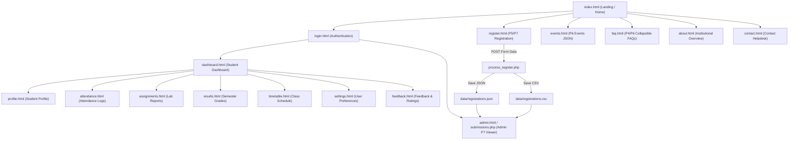

# 🎓 StudentHub — Unified Academic & Campus Web Portal
### Course: Web Development Frameworks (ITUE203)
**Faculty of Technology & Engineering (FTE) | CHARUSAT**  
**Semester: 3rd (Odd 2026-27)**  
**Developer:** Yuvraj Parmar | **Enrollment No.:** `25DCE070` | **Branch:** B.Tech Computer Engineering  

---

## 🌟 Executive Summary
**StudentHub** is a responsive, accessible, and full-stack student academic portal developed from the ground up to fulfill all laboratory requirements for **Practicals 1 through 7**.

The portal provides an all-in-one interface for students, faculty, and administrators to track academic progress, attendance percentage eligibility, course assignments, semester results, weekly timetables, dynamic campus events, interactive registration with HTML5 Canvas CAPTCHA, and server-side PHP form processing with safe CSV & JSON file-based storage.

---

## 📋 Comprehensive Practical Coverage (Practicals 1 to 7)

| Practical No. | Core Title & Concepts | Key Implementation in StudentHub | Status |
| :--- | :--- | :--- | :---: |
| **Practical 1** | **Project Initiation, Requirement Analysis, Sitemap & Wireframes** | Defined problem scope, user roles (Student/Admin), 10+ page sitemap, directory architecture, and Git repository setup. | ✅ Completed |
| **Practical 2** | **Semantic HTML5 with Accessibility Structure** | Built 12+ semantic pages (`<header>`, `<nav>`, `<main>`, `<section>`, `<article>`, `<aside>`, `<footer>`), skip-to-content links, ARIA labels, breadcrumb navigation, and alt texts. | ✅ Completed |
| **Practical 3** | **Responsive UI Design with CSS Grid & Flexbox** | Mobile-first CSS3 layout system with CSS variables (tokens), dark & light mode palettes, responsive cards, buttons, badges, and cross-device media queries. | ✅ Completed |
| **Practical 4** | **JavaScript DOM Manipulation, Events & Interactivity** | Implemented interactive hero content carousel, collapsible FAQ accordions, accessible modal dialogs, dynamic toast notification system, mobile hamburger drawer, and `localStorage` theme switcher. | ✅ Completed |
| **Practical 5** | **Registration Form with Frontend Validation & UX** | Real-time Regex input validation (Name, ID, Email, Phone, Password), live password strength meter bar with criteria checklist, HTML5 Canvas CAPTCHA with noise & refresh button, and inline error hints. | ✅ Completed |
| **Practical 6** | **External JSON Rendering with Fetch API, Search & Filters** | Dynamic data consumption from `events.json`, `students.json`, `faqs.json`, `notices.json` with debounced search, multi-category filters, multi-criteria sorting, client-side pagination, and dependent dropdowns (`locations.json`). | ✅ Completed |
| **Practical 7** | **PHP Form Processing with Server-Side Validation & CSV/JSON Storage** | Server-side POST handler (`process_register.php`, `process_contact.php`, `process_feedback.php`), input sanitization (`htmlspecialchars`, `filter_var`), atomic file writes with `LOCK_EX` into `registrations.json` & `registrations.csv`, and admin submissions viewer (`submissions.php` / `admin.html`). | ✅ Completed |

---

## 🗺️ Project Sitemap & Navigation Flow



---

## 🗂️ Project Directory Structure

```
StudentHub/
│
├── css/
│   └── style.css                 # Master modern design system (Grid, Flexbox, Dark/Light tokens)
│
├── js/
│   └── main.js                   # Master JS logic (DOM, Carousel, Modals, Validation, CAPTCHA, Fetch API)
│
├── data/
│   ├── events.json               # 16+ Campus Events with tags, seats, venue, speaker (P6)
│   ├── students.json             # 16+ Student directory profiles with GPA & skills (P6)
│   ├── faqs.json                 # 16+ Categorized FAQs for accordion rendering (P4 & P6)
│   ├── notices.json              # Campus circulars & announcements feed (P6)
│   ├── locations.json            # Country -> State -> City hierarchy for dependent dropdowns (P6)
│   ├── registrations.json        # Practical 7 JSON registration storage
│   ├── registrations.csv         # Practical 7 CSV registration storage
│   ├── contacts.json             # Stored contact inquiries (JSON)
│   ├── contacts.csv              # Stored contact inquiries (CSV)
│   ├── feedbacks.json            # Stored ratings & reviews (JSON)
│   └── feedbacks.csv             # Stored ratings & reviews (CSV)
│
├── index.html                    # Home / Landing Portal with Hero Carousel & Live Widgets
├── dashboard.html                # Student Dashboard with metrics, schedule & alerts
├── register.html                 # Student Registration with Regex Validation & Canvas CAPTCHA (P5)
├── events.html                   # Dynamic Events Explorer with Search, Filter & Pagination (P6)
├── profile.html                  # Student Profile with CGPA breakdown and skills tags
├── attendance.html               # Subject-wise attendance percentages & leave application
├── assignments.html              # Academic assignments & lab upload modal
├── results.html                  # Semester examination results & transcripts
├── timetable.html                # Weekly lecture and lab timetable schedule
├── faq.html                      # Collapsible FAQ Accordion with live search (P4 & P6)
├── feedback.html                 # Student ratings & feedback form (P7)
├── about.html                    # Institutional background & developer portfolio
├── contact.html                  # Helpdesk contact form & campus details
├── login.html                    # Authentication portal with role switcher & demo logins
├── settings.html                 # Account preferences, theme switcher & cache management
├── admin.html                    # Admin Management Portal & Submissions Viewer (P7)
│
├── process_register.php          # Practical 7 PHP POST processor & file storage (JSON/CSV)
├── process_contact.php           # Practical 7 PHP contact inquiry processor
├── process_feedback.php          # Practical 7 PHP feedback & star rating processor
├── submissions.php               # Practical 7 PHP server-rendered CSV/JSON data table viewer
├── api.php                       # Lightweight REST JSON API router
│
├── class.css                     # Backward-compatibility stylesheet bridge
├── script.js                     # Root JavaScript bridge
└── README.md                     # Comprehensive Project Documentation
```

---

## 💻 Technologies Used

- **Frontend Core**: HTML5 (Semantic elements, ARIA accessibility, Canvas API), CSS3 (CSS Grid, Flexbox, Custom Properties, Dark Mode), JavaScript (ES6+, Fetch API, Promises, DOM Manipulation, LocalStorage).
- **Backend & Storage (Practical 7)**: PHP 7.4 / 8.x, JSON File System, CSV File Writing (`fputcsv`, `flock`), RESTful JSON endpoints.
- **Typography & Icons**: Google Fonts (`Outfit`, `Plus Jakarta Sans`), Unicode Emojis & SVG iconography.
- **Development Tools**: Visual Studio Code, Git / GitHub, XAMPP / Apache, Browser DevTools.

---

## 🚀 How to Run the Project

### Option 1: Running with PHP / XAMPP (Full Stack Mode - Practicals 1 to 7)
1. Copy the project folder into your web server root (e.g. `C:\xampp\htdocs\StudentHub\`).
2. Start the **Apache** server in the XAMPP Control Panel.
3. Open your browser and navigate to:
   ```
   http://localhost/StudentHub/
   ```
4. Access `register.html` or `contact.html` to submit forms, and view stored records in `submissions.php` and `admin.html`.

### Option 2: Running with VS Code Live Server (Static Frontend Mode)
1. Open the workspace in VS Code.
2. Right-click on `index.html` and select **"Open with Live Server"**.
3. All frontend DOM manipulations, Canvas CAPTCHA, real-time validations, JSON Fetch API rendering, search, filter, pagination, and local storage simulators will run smoothly.

---

## 👨‍💻 Student Details
- **Student Name:** Yuvraj Parmar
- **Enrollment Number:** `25DCE070`
- **Class / Semester:** 3rd Semester, B.Tech Computer Engineering (Odd 2026-27)
- **Institution:** Faculty of Technology and Engineering (FTE), CHARUSAT
- **Subject:** Web Development Frameworks (`ITUE203`)
